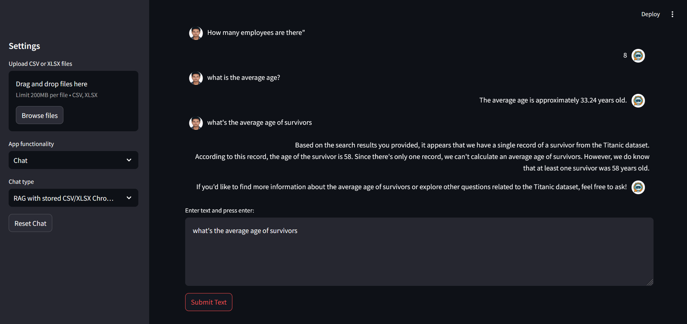

# GenAI_for_SQL_CSV 

`GenAI_for_SQL_CSV` is a chatbot QA project that utilizes <u>Llama 3 from Olama</u>, <u>Langchain</u>, <u>SQLite</u>, and <u>ChromaDB</u> and allows users to interact (perform <u>Q&A</u> and <u>RAG</u>) with SQL databases, CSV, and XLSX files using natural language.

**Key NOTE:** Remember to NOT use a SQL databbases with WRITE privileges. Use only READ and limit the scope. Otherwise your user could manupulate the data (e.g ask your chain to delete data).

## Features:
- Chat with SQL data.
- Chat with preprocessed CSV and XLSX data.
- Chat with uploaded CSV and XSLX files during the interaction with the user interface.
- RAG with Tabular datasets.


## Main underlying techniques used in this chatbot:
- LLM chains and agents
- Llama
- Retrieval Augmented generation (RAG)
- Python
- Streamlit
- SQLAlchemy

## Models used in this chatbot:
- Llama 3 from olama

**Key NOTE:** You need to first download Olama and then can ise Llama3 from there. Other possibilities is that you download quantized version of Llama3 from HuggingFace locally and use it.


## Installation:
- Ensure you have Python installed along with required dependencies.
```
- Make a virtual env 
- git clone the repo
- activate virtual env
- install all requirements using pip install -r requirements.txt
- to run the project: got to src and run streamlit run app.py

```


## Chatbot User Interface



## Databases:
- Diabetes dataset: [Link](https://www.kaggle.com/datasets/akshaydattatraykhare/diabetes-dataset?resource=download&select=diabetes.csv)
- Cancer dataset: [Link](https://www.kaggle.com/datasets/rohansahana/breast-cancer-dataset-for-beginners?select=train.csv)
- Chinook database: [Link](https://database.guide/2-sample-databases-sqlite/)

